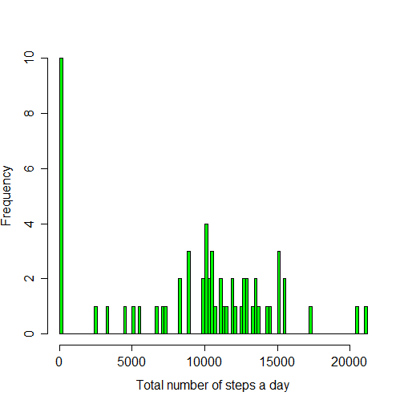
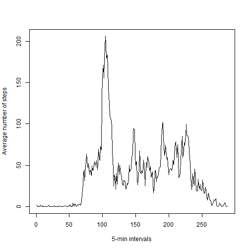
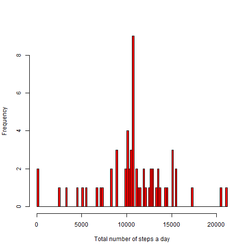

# PEER ASSESSMENT 1

### Loading and preprocessing the data

1. Load the data from the working dirrectory and assign it the name "data"

```r
data <- read.csv("C:/Users/Sony/Documents/R stuff/activity.csv")
```

2. Splitting all the data by days

```r
split_data <- split(data, data$date)
```

### What is mean total number of steps taken per day?

1. Make a histogram of the total number of steps taken each day

```r
total_steps <- numeric()
dates <- levels(data$date)
for (i in 1:61) {
  day_x <- as.data.frame(split_data[i])
  
# Calculating the sum of steps per day
  sum.steps_day_x <- sum(day_x[, 1][!is.na(day_x[, 1])])
  total_steps <- rbind(total_steps, sum.steps_day_x, deparse.level = 0)
}
total_steps <- as.data.frame(total_steps, row.names = dates)

# Drawing the histogram
hist(total_steps$V1, col = "green", breaks = 100,
     xlab = "Total number of steps a day", main = NULL)
dev.copy(png, file = "hist1.png", width = 480, height = 480, units = "px")
```

```
## png 
##   5
```

```r
dev.off()
```

 

```
## RStudioGD 
##         2
```

2. The mean number of steps taken per day

```r
mean(total_steps$V1)
```

```
## [1] 9354
```

The median number of steps taken per day

```r
median(total_steps$V1)
```

```
## [1] 10395
```
### What is the average daily activity pattern?

1. A time series plot of the 5-minute interval (x-axis) and the average number of steps taken, averaged across all days (y-axis)

```r
# Split the data for 5-min intervals
split_data_5m <- split(data, as.factor(data$interval))
mean_steps <- numeric()
intervals <- levels(as.factor(data$interval))
for (i in 1:288) {
  interval_x <- as.data.frame(split_data_5m[i])
  
  # Calculate mean accross 5-min intervals ignoring NAs
  mean.steps_interval_x <- mean(interval_x[, 1][!is.na(interval_x[, 1])])
  mean_steps <- rbind(mean_steps, mean.steps_interval_x, deparse.level = 0)
}
mean_steps <- as.data.frame(mean_steps, row.names = intervals)

# Drawing the plot
plot(x = mean_steps$V1, type = "l",
     xlab ="5-min intervals", ylab = "Average number of steps")
```

 

```r
dev.copy(png, file = "plot1.png", width = 480, height = 480, units = "px")
```

```
## png 
##   5
```

```r
dev.off()
```

 

```
## RStudioGD 
##         2
```

2. Which 5-minute interval, on average across all the days in the dataset, contains the maximum number of steps?

```r
rownames(which(mean_steps == max(mean_steps$V1), arr.ind = TRUE))
```

```
## [1] "835"
```

### Imputing missing values

1. Total number of missing values in the dataset

```r
length(data[is.na(data)])
```

```
## [1] 2304
```

2. Strategy for missing values in the dataset.

- There are days that do not contain any useful information, i.e. all the values for number of steps there are missing (e.g. 2012-10-01). Therefore, it is not possible to assign to these days(or 5-min intervals in these days) any relevant values (there would be NAs also for median/mean values of that day, because there is no data, to be precise there are only missing values, to calculate these median/mean values).

- It means that for such days we should use some values for other days if we want to inclued these days into our analysis.

- To keep it simple, I will assign the mean value across the whole analyzinf period to all NAs in the final datasets. 

3. Create a new dataset incorporating the above mentioned strategy for treating the missing values


```r
# Creating new dataset
total_steps <- numeric()
dates <- levels(data$date)
for (i in 1:61) {
  day_x <- as.data.frame(split_data[i])
  
  # Calculating the sum of steps per day (NAs are taken into account)
  sum.steps_day_x <- sum(day_x[, 1])
  total_steps <- rbind(total_steps, sum.steps_day_x, deparse.level = 0)
}

# Assign mean value to all NAs in the dataset
total_steps[is.na(total_steps)] <- mean(total_steps[!is.na(total_steps)])
total_steps <- as.data.frame(total_steps, row.names = dates)
```

4. Make a histogram of the total number of steps taken each day


```r
# Drawing the histogram
hist(total_steps$V1, col = "red", breaks = 100,
     xlab = "Total number of steps a day", main = NULL)
```

 

```r
dev.copy(png, file = "hist2.png", width = 480, height = 480, units = "px")
```

```
## png 
##   5
```

```r
dev.off()
```

 

```
## RStudioGD 
##         2
```

The mean number of steps taken per day

```r
mean(total_steps$V1)
```

```
## [1] 10766
```

The median number of steps taken per day

```r
median(total_steps$V1)
```

```
## [1] 10766
```
You can see that both histogram and mean/median values of original data differ from the final dataset. Thus, treating NA values may significantly influence the results of the analysis.

### Are there differences in activity patterns between weekdays and weekends?

I didn't manage to make it :`(
